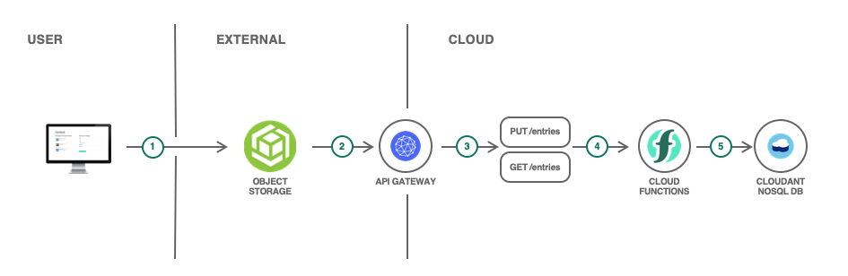

# Final Project Overview and Grading Criteria

You will have the opportunity to take your serverless and microservices skills and put them into action in a project that combines these technologies into a single web application. You will create a serverless web application -- a simple guestbook website where users can post messages -- and you will host the website in two different ways.

Below is the architecture for one version which uses object storage to host the site's files.

## Review Criteria:
* **Task 1:** Provide a screenshot of the “All Documents” page of your guestbook database within the Cloudant dashboard. Click the “{} JSON” button at the top to show the documents in JSON format. Make sure your screenshot includes two documents: one for the John Smith test user and one for another comment you submitted yourself.

* **Task 2:** Provide a screenshot showing the five actions you created in the guestbook package for this project. Two of these actions should be sequences for which a web action is enabled, and three should be Node.js actions for which web actions are not enabled. Make sure these are named as stipulated in the final project. (5 pts)

* **Task 3:** Provide a screenshot showing the guestbook/read-guestbook-entries-sequence sequence and the sequence actions in the appropriate order. Two of the actions should be in the guestbook package, and one should be in the binding-for-guestbook package. (3 pts)

* **Task 4:** Provide a screenshot showing the guestbook/save -guestbook-entry-sequence sequence and the sequence actions in the appropriate order. One of the actions should be in the guestbook package, and one should be in the binding-for-guestbook package. (3 pts)

* **Task 5:** Provide a screenshot showing the “Define and Secure” page for the API that you created. Ensure that the API is online. The screenshot should show the two operations that you created. (5 pts)

* **Task 6:** Provide a screenshot showing your deployed microservice guestbook front end on OpenShift. The URL should be visible to ensure that this front end was deployed on OpenShift. The screenshot should also show at least two entries: the John Smith test entry and one other. (3 pts)

* **Task 7:** Provide a screenshot showing the deployed guestbook front end hosted on object storage. The URL should be visible to ensure that this front end was deployed using object storage. The screenshot should also show at least two entries: the John Smith test entry and one other. (3 pts)

## Final Project
* [Serverless Web Application and API](./files/coding-labs.pdf)
